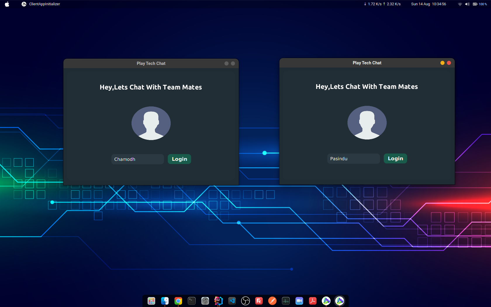
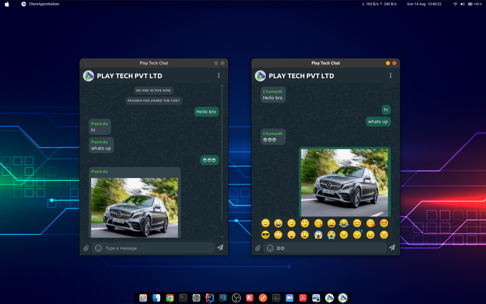
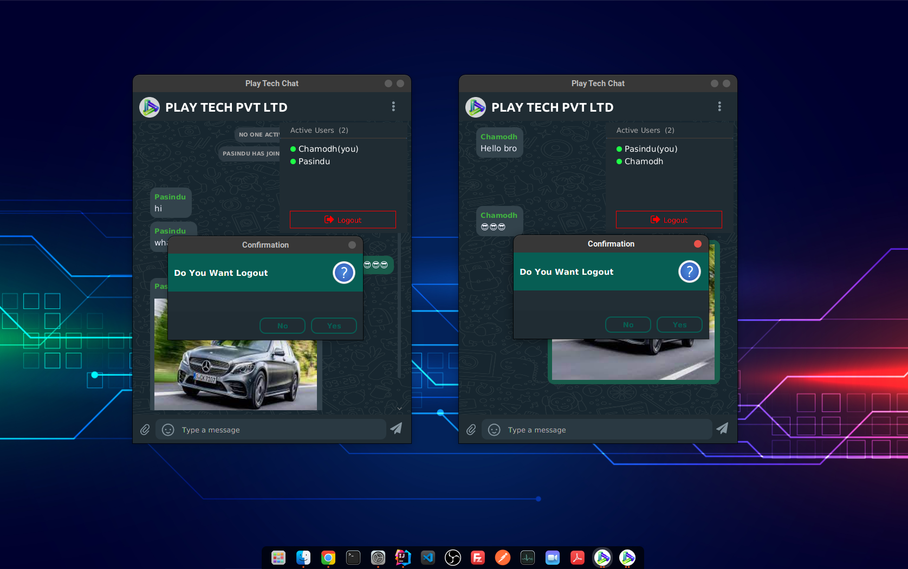

# Multi User Chat Application

## Description
#### This is simple chat application for demonstrate the knowledge of network programming
#### The system can use many users with using same ip address and server port

#### This System can be handled below activities,
* Login with use your username
* Check active users
* send messages to group
* send images to group
* send emojis to group
## Sample Screenshots

## Tech/framework used
* Java
* JavaFx
* Multi Threading
* MVC extended Architecture

**Developed By _Chamodh Pasindu_**